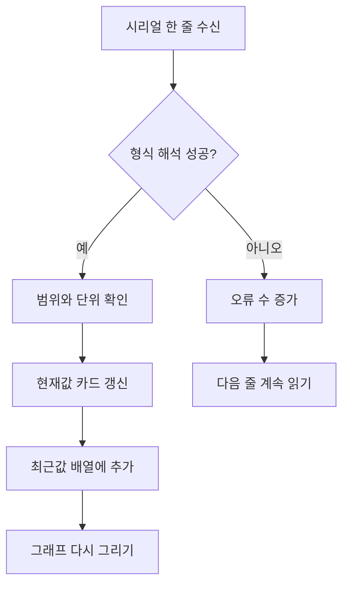

# 6단계. 실시간 센서 대시보드

[전체 강의자료](../README.md) · [이전 단계: Arduino와 웹 연결](../05_web_serial/README.md) · [다음 단계: 웹 조명 제어](../07_light_control/README.md)

## 권장 수업 시간과 결과물

- 권장 시간: 2차시
- 결과물: 현재값 카드, 최근 12초 그래프, 데이터 품질 표시가 있는 센서 대시보드
- 웹 코드: [`web/06_dashboard`](../../web/06_dashboard)
- 로컬 주소: `http://localhost:8000/web/06_dashboard/`

## 이번 단계에서 만들 것

Arduino에서 받은 센서값을 숫자 카드와 최근 12초 그래프로 표시합니다. 정상 데이터 수, 해석 오류 수, 마지막 수신 시각도 함께 보여 주는 실시간 대시보드를 완성합니다.

키트가 없어도 가상 센서의 자동 변화와 슬라이더를 이용해 시각화 기능을 모두 시험할 수 있습니다.

## 학습목표

- 현재값과 시간에 따른 변화 그래프가 주는 정보를 구분할 수 있다.
- 센서별 값의 범위와 단위를 화면에 알맞게 표현할 수 있다.
- 정상값·측정 실패·형식 오류를 서로 다르게 처리할 수 있다.
- 그래프를 이용해 변화, 이상값, 측정 지연을 찾을 수 있다.

## 핵심 질문

센서값을 어떤 형태로 보여 주어야 현재 상태와 변화 과정을 빠르게 알아볼 수 있을까요?

## 준비물

- 5단계 Arduino 코드가 업로드된 키트 또는 가상 센서 모드
- Chrome 또는 Edge
- 6단계 코드: [`web/06_dashboard`](../../web/06_dashboard)

## 시작 전 확인

- [ ] Part 5에서 실제 센서 JSON과 `pong`을 확인했다.
- [ ] 프로젝트 루트에서 로컬 웹서버를 실행했다.
- [ ] 실제 Arduino를 사용할 때 시리얼 모니터를 닫았다.
- [ ] 센서의 원본 범위와 단위를 알고 있다.

## 대시보드 구성

| 화면 요소 | 보여 주는 정보 | 확인할 점 |
|---|---|---|
| 현재값 카드 | 가장 최근 센서값 | 범위와 단위가 맞는가? |
| 시계열 그래프 | 최근 약 12초 변화 | 증가·감소·급격한 변화를 찾을 수 있는가? |
| 연결 상태 | 가상 센서 또는 Arduino | 데이터 출처를 혼동하지 않는가? |
| 정상 데이터 수 | 해석에 성공한 줄 수 | 값이 계속 증가하는가? |
| 해석 오류 수 | 형식·범위 오류 수 | 오류 입력 뒤에도 다음 데이터가 들어오는가? |
| 마지막 데이터 | 최근 수신 시각 | 연결이 멈추었는지 알 수 있는가? |

현재값 카드는 **지금 어떤 상태인지**, 그래프는 **그 상태까지 어떻게 변했는지** 보여 줍니다. 둘 중 하나만으로는 모든 정보를 알 수 없습니다.

## 따라 하기

Part 5에서 만든 웹 파일을 새 완성본으로 교체하지 않습니다. 같은 `index.html`, `styles.css`, `app.js`에 다음 순서로 기능을 쌓습니다.

1. 센서 카드 한 개의 HTML을 직접 추가합니다.
2. `updateSensorCards()`에서 가변저항값 하나를 연결합니다.
3. 정상 작동 후 같은 구조를 조도·터치·거리 카드로 확장합니다.
4. 그래프 한 개를 만들고 새 데이터가 올 때 점을 추가합니다.
5. 같은 그래프 함수를 다른 센서에도 재사용합니다.

한 번에 완성 대시보드를 열지 말고 카드 하나와 그래프 하나가 연결되는 과정을 먼저 확인합니다.

### 1. 가상 센서로 화면 확인

`web/06_dashboard/index.html`을 엽니다. 처음에는 가상 센서가 자동으로 실행됩니다.

- 센서 카드 네 개의 값이 변하는지 봅니다.
- 각 그래프가 오른쪽에서 왼쪽으로 기록되는지 확인합니다.
- 정상 데이터 수가 계속 증가하는지 확인합니다.
- 터치가 감지될 때 카드 표시가 달라지는지 확인합니다.

### 2. 수동으로 센서 변화 만들기

`값을 자동으로 변화시키기`를 끕니다. 가변저항·조도·거리 슬라이더를 한 번에 하나씩 움직입니다. 터치 스위치도 바꿉니다.

값을 급하게 바꿀 때와 천천히 바꿀 때 그래프 모양을 비교합니다.

### 3. 현재값과 그래프 비교

현재값 카드는 지금의 상태를 빠르게 보여 줍니다. 그래프는 값이 어떻게 그 상태에 도달했는지 보여 줍니다.

예를 들어 거리 카드가 30 cm라고 해도 그래프를 보면 물체가 천천히 다가왔는지, 갑자기 나타났는지 구분할 수 있습니다.

## 1차시 활동. 같은 현재값, 다른 변화 과정

가상 센서의 자동 변화를 끄고 거리 슬라이더를 사용합니다.

1. 100cm에서 30cm까지 10초 동안 천천히 줄입니다.
2. 다시 100cm로 옮긴 뒤 30cm로 한 번에 줄입니다.
3. 두 경우 모두 마지막 현재값은 30cm인지 확인합니다.
4. 그래프 모양이 어떻게 다른지 설명합니다.

| 시험 | 마지막 현재값 | 그래프 모양 | 알 수 있는 움직임 |
|---|---:|---|---|
| 천천히 접근 |  |  |  |
| 갑자기 접근 |  |  |  |

### 4. Arduino 연결

5단계 완성 코드를 Arduino에 업로드합니다. Arduino IDE의 시리얼 모니터를 닫습니다.

`Arduino 연결`을 누르고 포트를 선택합니다. 상태가 `Arduino 연결됨`으로 바뀌면 가상 센서는 자동으로 멈춥니다.

### 5. 센서별 실제 변화 확인

1. 가변저항을 최소에서 최대로 천천히 돌립니다.
2. 조도센서를 손으로 가렸다가 밝은 곳에 둡니다.
3. 터치센서를 짧게 누르고 길게 누릅니다.
4. 초음파센서 앞 물체를 20 cm에서 100 cm까지 이동합니다.

카드·그래프·실제 동작이 일치하는지 기록합니다.

## 데이터 처리 흐름

하나의 잘못된 데이터 때문에 전체 대시보드가 멈추지 않도록, 오류를 표시한 뒤 다음 줄을 계속 처리합니다.

## 2차시 활동. 데이터 품질 판단

측정 실패와 형식 오류는 같은 문제가 아닙니다.

- 거리 `null`: JSON 형식은 정상이지만 초음파 반사파를 받지 못함
- JSON 오류: 데이터 문장 자체를 해석할 수 없음
- 범위 오류: JSON은 해석했지만 값이 센서 허용 범위를 벗어남

정상 데이터 뒤에 오류 데이터 하나를 넣고 다시 정상 데이터를 보냅니다. 오류 수는 증가하지만 이후 정상 데이터가 계속 그래프에 추가되어야 합니다.

| 데이터 예 | 분류 | 화면에서 기대할 처리 |
|---|---|---|
| `{"type":"sensor","pot":512,"light":640,"touch":false,"distance":30}` | 정상 | 카드와 그래프 갱신 |
| 거리값 `null` | 측정 실패 | 거리 선이 잠시 끊김 |
| JSON 쉼표 누락 | 형식 오류 | 오류 수 증가, 다음 줄 계속 처리 |
| 가변저항 2000 | 범위 오류 | 오류 수 증가, 잘못된 값은 표시하지 않음 |

## 센서별 표시 기준

| 센서 | 원본 범위 | 화면 표시 | 측정 실패 처리 |
|---|---|---|---|
| 가변저항 | 0~1023 | 숫자와 연속 그래프 | 범위 밖이면 오류 |
| 조도센서 | 0~1023 | 숫자와 연속 그래프 | 범위 밖이면 오류 |
| 터치센서 | `true`, `false` | 감지·없음과 0·1 그래프 | 해석할 수 없으면 오류 |
| 초음파센서 | 0~500 cm | cm 숫자와 거리 그래프 | `null`이면 그래프 선 끊김 |

실제 키트에서는 밝을 때 약 15, 가렸을 때 약 850으로 측정되어 **값이 클수록 어둡습니다**.

## 정상 작동 확인표

| 확인 항목 | 정상 기준 | 결과 |
|---|---|---|
| 가상 센서 시작 | 페이지를 열면 값과 그래프 변화 |  |
| 수동 슬라이더 | 조작한 센서만 원하는 방향으로 변화 |  |
| Arduino 연결 | 가상 모드가 멈추고 실제 값 표시 |  |
| 데이터 수 | 200 ms 전송 기준 계속 증가 |  |
| 측정 실패 | 거리 카드에 실패 표시, 그래프 선 끊김 |  |
| 형식 오류 | 오류 수 증가 후 다음 정상값 계속 처리 |  |
| 작은 화면 | 카드가 4열·2열·1열로 알맞게 배치 |  |

## 자주 생기는 오류

| 문제 | 확인할 것 | 해결 방법 |
|---|---|---|
| 그래프가 움직이지 않음 | 가상 모드·자동 변화 체크 | 가상 모드와 자동 변화를 켜거나 Arduino 연결 |
| 카드 하나만 `---` 표시 | 해당 JSON 키의 이름과 값 | 5단계 권장 키와 범위로 수정 |
| 거리 그래프가 자주 끊김 | `distance:null` 수신 여부 | 초음파센서 방향·물체 표면·결선 확인 |
| 오류 수가 계속 증가 | 최근 안내와 원문 데이터 | JSON 한 줄 형식과 줄바꿈 확인 |
| 실제 연결 뒤 가상값이 보임 | 화면의 데이터 출처 표시 | 연결을 해제하고 다시 연결 |
| 값은 오지만 오래된 상태 표시 | 전송 간격·USB 연결 | Arduino 코드 실행과 케이블 상태 확인 |

## 실험 기록

| 센서 | 만든 변화 | 카드에서 확인한 값 | 그래프 모양 | 해석 |
|---|---|---|---|---|
| 가변저항 | 최소→최대 |  |  |  |
| 조도 | 가림→밝은 빛 |  |  |  |
| 터치 | 짧게→길게 |  |  |  |
| 거리 | 20 cm→100 cm |  |  |  |

## 그래프 해석 문장 만들기

다음 틀을 사용해 센서 하나를 해석합니다.

> ______ 센서를 ______에서 ______로 바꾸었더니 값이 ______했다. 현재값 카드는 ______을 보여 주었고, 그래프의 ______ 모양을 통해 변화가 ______하게 일어났음을 알 수 있었다.

## 도전과제

1. 그래프 기록을 12초에서 30초로 늘리고 변화 관찰에 어떤 차이가 있는지 비교합니다.
2. 최근 10개 거리값의 평균을 카드에 추가합니다.
3. 센서값이 일정 범위를 벗어나면 카드 테두리색이 바뀌게 합니다.
4. 정상 데이터와 오류 데이터의 비율을 계산해 `데이터 품질`로 표시합니다.
5. 가상 센서에 거리 측정 실패가 가끔 발생하도록 만들어 그래프의 끊김을 관찰합니다.

## Part 6 마무리 질문

1. 현재값 카드와 시간 그래프가 알려 주는 정보는 어떻게 다른가?
2. 거리값 `null`과 JSON 형식 오류는 어떻게 다른가?
3. 잘못된 데이터 한 줄 때문에 대시보드 전체를 멈추지 않는 이유는 무엇인가?
4. 그래프 기록 시간을 12초에서 30초로 늘리면 어떤 장단점이 생기는가?

## 제출할 결과

- 같은 현재값, 다른 변화 과정 활동표
- 실제 센서 실험 기록표
- 그래프 해석 문장 1개
- 정상 작동 확인표와 Part 6 마무리 질문 답변

## 실제 키트에서 확인한 값

- 조도센서는 값이 클수록 어두움
- 초음파센서는 10cm·30cm 시험에서 실제 거리와 대략 일치
- 200ms 전송에서 센서 카드와 그래프가 정상 갱신
- Web Serial 연결과 PING 응답 정상

30분 이상 장시간 안정성은 최종 통합본 전시 시험에서 확인합니다.

## 이번 단계 모범답안

활동과 자기 점검을 끝낸 뒤 확인합니다.

- [Part 6까지의 웹 누적 모범답안](../../web/06_dashboard)

Part 5 파일과 비교해 새 HTML 요소, 값 갱신 함수, 그래프 데이터 저장과 그리기 함수만 찾아 자신의 코드와 대조합니다.

## 다음 단계 예고

7단계에서는 웹에서 색·밝기·자동 또는 수동 모드를 선택해 화면 속 네오픽셀과 실제 네오픽셀에 같은 명령을 보냅니다.
