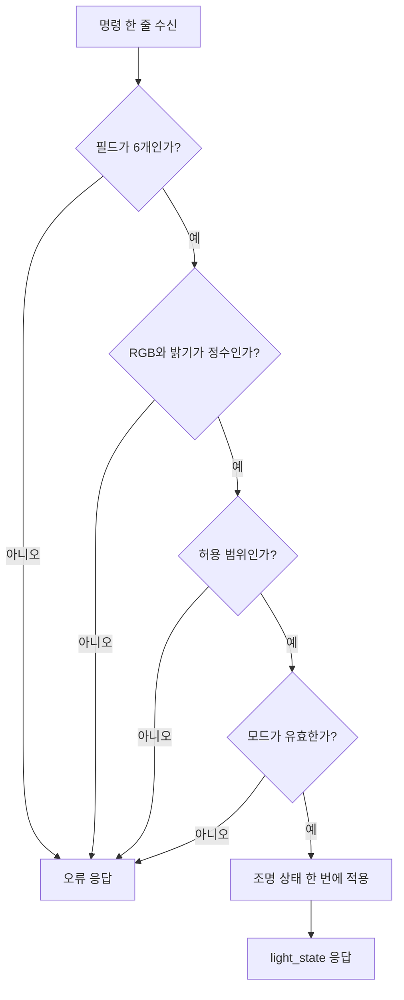

# 7단계. 웹에서 무드등 제어

[전체 강의자료](../README.md) · [이전 단계: 실시간 대시보드](../06_dashboard/README.md) · [다음 단계: 표정 특징 AI](../08_expression_ai/README.md)

## 권장 수업 시간과 결과물

- 권장 시간: 2차시
- 결과물: 웹에서 RGB·밝기·모드를 정해 실제 네오픽셀과 2D 디지털 트윈을 함께 바꾸는 페이지
- Arduino 코드: [`07_light_control.ino`](../../arduino/07_light_control/07_light_control.ino)
- 웹 코드: [`web/07_light_control`](../../web/07_light_control)
- 로컬 주소: `http://localhost:8000/web/07_light_control/`

## 이번 단계에서 만들 것

웹에서 RGB 색상·밝기·모드를 정하고 Arduino로 전송해 8구 네오픽셀을 바꿉니다. 같은 명령을 2D 디지털 트윈에도 표시합니다.

## 학습목표와 핵심 질문

- 웹에서 만든 값을 한 줄의 통신 명령으로 표현할 수 있다.
- 잘못된 명령을 Arduino가 실행하지 않도록 범위를 검사할 수 있다.
- 명령 상태와 실제 장치 상태의 차이를 설명할 수 있다.

**핵심 질문:** 웹에서 만든 명령을 Arduino가 안전하게 실행하려면 어떤 규칙이 필요할까요?

## 시작 전 확인

- [ ] 프로젝트 루트에서 `python3 -m http.server 8000`을 실행했다.
- [ ] Chrome 또는 Edge에서 7단계 주소를 열었다.
- [ ] 실제 키트를 사용할 때 Arduino IDE 시리얼 모니터를 닫았다.
- [ ] 네오픽셀 데이터 핀 D7과 밝기 상한 80을 확인했다.

이번 단계에서는 센서 측정을 잠시 분리하고 **웹 → Arduino 조명 명령**만 집중해 확인합니다.

## 준비물과 코드

- Arduino UNO, 네오픽셀 8구, USB 케이블
- Arduino 코드: [`arduino/07_light_control`](../../arduino/07_light_control)
- 웹 코드: [`web/07_light_control`](../../web/07_light_control)
- Chrome 또는 Edge

## 따라 하기

1. 키트가 없으면 웹에서 `가상 연결(Mock)`을 선택합니다.
2. 연결 후 색상과 밝기를 정하고 명령을 보냅니다.
3. 8개 가상 픽셀과 전송 기록이 같은지 확인합니다.
4. 키트가 있으면 Arduino 코드를 업로드하고 시리얼 모니터를 닫습니다.
5. 전송 방법을 `Arduino USB`로 바꾸고 장치를 선택합니다.
6. 실제 LED와 화면 속 디지털 트윈을 비교합니다.

## 1차시. 가상 연결로 명령 만들기

### 1. 연결 방법 선택

`가상 연결(Mock)`을 선택하고 `연결`을 누릅니다. 이 방법은 실제 Arduino 없이도 명령 생성, 값 검사, 화면 표시를 연습합니다.

### 2. 수동 조명 설정

1. 파랑·주황·보라·초록·흰색 프리셋을 차례로 누릅니다.
2. 밝기를 0, 20, 40, 80으로 바꿉니다.
3. `조명 명령 보내기`를 누릅니다.
4. 명령 기록과 8구 디지털 트윈을 비교합니다.

| 설정 | 예상 명령 | 디지털 트윈 | 확인 |
|---|---|---|---|
| 파랑, 밝기 40 | `LIGHT,59,130,246,40,MANUAL` | 파란색 8구 |  |
| 주황, 밝기 20 | RGB와 밝기 20 반영 | 주황색 8구 |  |
| 흰색, 밝기 0 | 밝기 0 | 꺼짐 |  |
| 초록, 밝기 80 | 밝기 상한 80 | 가장 밝은 초록 |  |

### 3. 잘못된 값 확인

RGB는 각각 0~255, 밝기는 0~80만 허용합니다. 범위를 벗어난 값이나 숫자가 아닌 값을 넣었을 때 명령이 전송되지 않아야 합니다.

| 잘못된 입력 | 거부해야 하는 이유 | 화면 메시지 |
|---|---|---|
| R = 300 | RGB 허용 범위 초과 |  |
| 밝기 = 100 | 안전 상한 초과 |  |
| 모드 = TEST | 허용하지 않은 모드 |  |

## 통신 문장 읽기

```text
LIGHT,59,130,246,40,MANUAL
```

| 필드 | 뜻 | 허용값 |
|---|---|---|
| `LIGHT` | 조명 명령 | 고정 |
| `59,130,246` | R,G,B | 각각 0~255 |
| `40` | 밝기 | 0~80 |
| `MANUAL` | 제어 주체 | MANUAL 또는 AUTO |

Arduino는 모든 필드를 검사한 뒤 정상일 때만 LED를 한 번에 변경합니다.

## 왜 CSV 명령을 사용했을까?

센서 데이터는 이름이 여러 개인 JSON이 읽기 편하지만, 조명 명령은 필드 수와 순서가 고정되어 있어 짧은 CSV 문장으로도 명확하게 표현할 수 있습니다.

```text
LIGHT,59,130,246,40,MANUAL
  종류  R   G   B  밝기  모드
```

중요한 것은 JSON과 CSV 중 하나가 항상 더 좋다는 것이 아니라, 보내는 데이터의 구조에 맞게 규칙을 정하고 송신자와 수신자가 같은 규칙을 사용하는 것입니다.

## Arduino의 안전한 명령 처리 순서



검사가 끝나기 전에 일부 값만 바꾸면 잘못된 명령이 장치에 부분적으로 적용될 수 있습니다. 따라서 모든 필드를 먼저 검사한 뒤 RGB·밝기·모드를 한 번에 갱신합니다.

## 2차시. 실제 Arduino와 양방향 확인

### 1. Arduino 준비

1. `arduino/07_light_control/07_light_control.ino`를 UNO에 업로드합니다.
2. 업로드가 끝나면 시리얼 모니터를 닫습니다.
3. 웹에서 전송 방법을 `Arduino USB(Web Serial)`로 바꿉니다.
4. `연결`을 누르고 UNO 포트를 선택합니다.

### 2. 명령과 실제 상태 비교

웹이 조명 명령을 보내면 Arduino는 실제 네오픽셀에 적용한 뒤 다음과 같은 상태를 돌려줍니다.

```json
{"type":"light_state","r":59,"g":130,"b":246,"brightness":40,"mode":"MANUAL"}
```

| 비교 대상 | 확인할 값 |
|---|---|
| 웹 설정 | 사용자가 고른 RGB·밝기·모드 |
| 전송 기록 | 실제로 보낸 CSV 명령 |
| 실제 네오픽셀 | 눈으로 본 색과 밝기 |
| `light_state` | Arduino가 적용했다고 응답한 값 |
| 디지털 트윈 | 응답을 반영한 화면 속 8구 조명 |

화면 속 조명이 바뀌었다는 사실만으로 실제 장치가 바뀌었다고 단정하지 않습니다. 최종 통합본에서는 반드시 Arduino의 `light_state` 응답을 기준으로 디지털 트윈을 갱신합니다.

## 확인표

| 시험 | 예상 결과 | 실제 결과 |
|---|---|---|
| 밝기 0 전송 | LED 꺼짐 |  |
| 밝기 80 전송 | 안전 상한으로 켜짐 |  |
| 파랑·주황·초록 전송 | 실제·화면 색 일치 |  |
| AUTO 전환 | 모드가 AUTO로 표시 |  |
| USB 분리 | 연결 끊김 안내 |  |

## 실습 기록

| 색상 | RGB | 밝기 | 보낸 명령 | `light_state` | 실제·화면 일치 |
|---|---|---:|---|---|---|
| 파랑 | 59, 130, 246 | 40 |  |  |  |
| 주황 | 249, 115, 22 | 20 |  |  |  |
| 흰색 | 255, 255, 255 | 0 |  |  |  |
| 내가 만든 색 |  |  |  |  |  |

## 자주 생기는 오류

| 문제 | 해결 방법 |
|---|---|
| 포트가 보이지 않음 | Chrome/Edge와 USB 데이터 케이블 확인 |
| 포트를 다른 앱이 사용 중 | Arduino IDE 시리얼 모니터 닫기 |
| 웹 화면만 바뀌고 LED는 그대로 | 7단계 Arduino 코드 업로드 여부 확인 |
| 색이 다르게 보임 | 네오픽셀 색상 순서가 `NEO_GRB`인지 확인 |
| 너무 밝거나 재부팅됨 | 밝기 상한 80 유지, 전원 결선 확인 |

| 오류 응답 | 뜻 | 확인할 것 |
|---|---|---|
| `invalid_format` | 명령 구조가 다름 | `LIGHT`와 필드 6개, 쉼표 위치 |
| `not_integer` | 숫자 자리에 다른 글자 | RGB·밝기 정수 입력 |
| `out_of_range` | 허용 범위 초과 | RGB 0~255, 밝기 0~80 |
| `invalid_mode` | 모드 이름 오류 | `MANUAL` 또는 `AUTO` |
| `command_too_long` | 수신 버퍼보다 긴 명령 | 불필요한 글자 제거 |

## 도전과제

1. 원하는 색 프리셋 하나를 추가하고 RGB 값을 기록합니다.
2. 전송 전 미리보기와 Arduino 응답 후 실제 상태 표시를 서로 다른 테두리로 구분합니다.
3. 잘못된 명령 `LIGHT,300,0,0,40,MANUAL`을 보내고 실제 조명이 이전 상태를 유지하는지 확인합니다.
4. `GET_LIGHT` 버튼을 만들어 현재 적용 상태를 다시 요청합니다.

## Part 7 마무리 질문

1. 조명 명령에서 각 필드의 순서가 중요한 이유는 무엇인가?
2. Arduino가 범위를 검사한 뒤 한 번에 상태를 적용하는 이유는 무엇인가?
3. 보낸 명령과 실제 적용 상태는 왜 다를 수 있는가?
4. 디지털 트윈을 `light_state` 응답으로 갱신해야 하는 이유는 무엇인가?

## 제출할 결과

- 확인표와 실제 조명 실습 기록
- 잘못된 입력 3종의 오류 결과
- 내가 만든 색의 RGB와 실제 사진 또는 관찰 기록
- Part 7 마무리 질문 답변

## 다음 단계

8단계에서는 조명을 바로 바꾸지 않고 웹캠 표정 특징과 AI 분류 성능부터 확인합니다.
