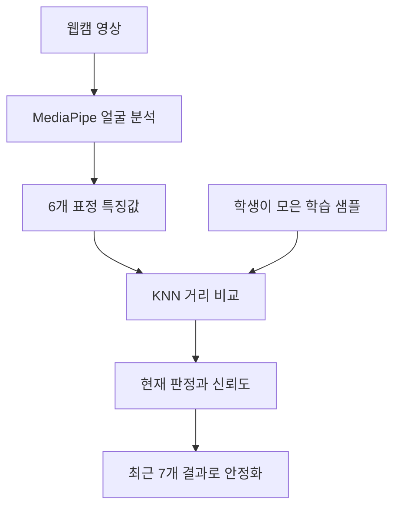

# 8단계. 웹캠 표정 특징과 AI 분류

[전체 강의자료](../README.md) · [이전 단계: 웹 조명 제어](../07_light_control/README.md) · [다음 단계: AI 자동 조명](../09_digital_twin/README.md)

## 권장 수업 시간과 결과물

- 권장 시간: 2~3차시
- 결과물: 학생이 직접 모은 표정 예시로 작동하는 4범주 KNN 분류기
- 웹 코드: [`web/08_expression_ai`](../../web/08_expression_ai)
- 로컬 주소: `http://localhost:8000/web/08_expression_ai/`

## 이번 단계에서 만들 것

웹캠 영상에서 AI가 표정 특징값을 추출하고, 학생이 직접 모은 예시를 이용해 `미소·중립·놀란 표정·찡그린 표정`을 분류하는 웹페이지를 만듭니다.

이 단계에서는 아직 분류 결과로 조명을 바꾸지 않습니다. 먼저 AI가 어떤 특징을 보고, 언제 틀리며, 신뢰도를 어디까지 믿을 수 있는지 확인합니다.

## 학습목표

- 얼굴 영상과 표정 특징값의 차이를 설명할 수 있다.
- 학습 데이터와 분류 데이터의 역할을 구분할 수 있다.
- KNN이 가까운 예시를 이용해 새 입력을 분류하는 원리를 설명할 수 있다.
- 같은 표정도 사람·조명·각도에 따라 분류가 달라지는 이유를 찾을 수 있다.

## 핵심 질문

AI의 분류 결과를 언제 믿고, 언제 다시 확인해야 할까요?

## 꼭 지킬 원칙

- 이 활동은 실제 감정을 알아내는 활동이 아닙니다.
- 화면에 나타난 얼굴 모양을 네 범주 중 하나로 분류합니다.
- 웹캠 영상과 얼굴 사진은 저장하거나 서버로 보내지 않습니다.
- 학습에는 입꼬리·입 벌림·눈·눈썹과 같은 특징 숫자만 사용합니다.
- 친구의 얼굴을 허락 없이 촬영하거나 분류하지 않습니다.

## 시작 전 확인

- [ ] 프로젝트 루트에서 로컬 웹서버를 실행했다.
- [ ] Chrome 또는 Edge에서 정확한 8단계 주소를 열었다.
- [ ] 브라우저의 카메라 권한을 허용할 수 있다.
- [ ] 인터넷 연결이 가능하다. 처음 MediaPipe 코드와 모델을 불러올 때 사용한다.
- [ ] 결과를 실제 감정 판정이라고 부르지 않기로 했다.

## 준비물

- 웹캠이 있는 컴퓨터
- Chrome 또는 Edge
- 인터넷 연결: 처음에 MediaPipe 코드와 모델을 불러올 때 필요
- 8단계 웹 코드: [`web/08_expression_ai`](../../web/08_expression_ai)

## AI가 보는 입력

| 특징값 | 관찰할 변화 |
|---|---|
| 입꼬리 올라감 | 미소를 지을 때 커지는지 확인 |
| 입 벌림 | 입을 크게 벌릴 때 커지는지 확인 |
| 눈 크게 뜸 | 놀란 표정에서 커지는지 확인 |
| 눈썹 안쪽 올라감 | 표정과 사람에 따라 변화 비교 |
| 눈썹 내림 | 찡그린 표정에서 커지는지 확인 |
| 입꼬리 내려감 | 찡그린 표정에서 변화 확인 |

AI는 이 여섯 값을 만드는 데 머신러닝 모델을 사용합니다. 이후 KNN 분류기는 현재 특징값과 학생이 저장한 표정별 특징값 사이의 거리를 비교합니다.

`입꼬리 내려감`은 사람, 각도, 조명에 따라 변화가 작을 수 있습니다. 막대 하나가 약하다고 전체 기능이 고장 난 것은 아닙니다. KNN은 여섯 특징을 함께 비교하며, 찡그린 표정에서는 `눈썹 내림`이 더 뚜렷한 사람도 있습니다.

## 표정 분류의 두 단계



MediaPipe는 영상에서 숫자 특징을 추출하고, KNN은 그 숫자를 학생이 저장한 예시와 비교합니다. 두 역할을 구분해야 오류 원인도 찾을 수 있습니다.

## 따라 하기

### 1. 페이지 열기

GitHub Pages 주소 또는 선생님이 안내한 로컬 주소로 8단계 페이지를 엽니다. 주소창 왼쪽에 자물쇠 표시가 있는지 확인합니다.

### 2. AI 모델 준비

`AI 모델 준비`를 누르고 상태가 `모델 준비 완료`로 바뀔 때까지 기다립니다. 실패하면 인터넷 연결을 확인하고, 우선 `가상 특징 모드`로 실습합니다.

### 3. 웹캠 시작

`웹캠 시작`을 누르고 카메라 사용을 허용합니다. 얼굴이 화면 중앙에 오도록 맞춥니다.

### 4. 특징값 관찰

표정을 하나씩 바꾸며 여섯 개 특징 막대가 어떻게 달라지는지 관찰합니다. 모든 사람에게 같은 특징이 같은 크기로 나타난다고 단정하지 않습니다.

## 1차시 활동. 특징값 관찰

아직 학습 버튼을 누르지 않고 얼굴 특징 막대만 관찰합니다. 표정 하나를 2~3초 유지한 뒤 가장 크게 변한 특징 두 개를 적습니다.

| 만든 얼굴 모양 | 가장 크게 변한 특징 1 | 특징 2 | 변화가 작았던 특징 | 관찰 조건 |
|---|---|---|---|---|
| 중립 |  |  |  | 정면·보통 조명 |
| 미소 |  |  |  |  |
| 놀란 표정 |  |  |  |  |
| 찡그린 표정 |  |  |  |  |

같은 표정을 옆을 보며 만들거나 조명을 어둡게 한 뒤 값이 달라지는지도 확인합니다.

### 5. 네 범주 학습

표정을 유지하며 각 카드의 `3초 학습`을 누릅니다. 한 번 누르면 특징값 15개를 모읍니다.

1. 미소
2. 중립
3. 놀란 표정
4. 찡그린 표정

처음에는 각 범주를 한 번씩 학습합니다. 성능이 낮으면 자세와 각도를 조금 바꾸어 한 번 더 학습합니다.

한 번의 `3초 학습`으로 특징 샘플 15개를 모읍니다. 표정을 만드는 도중에 버튼을 누르면 중립에서 목표 표정으로 바뀌는 중간 모습도 학습될 수 있습니다. 먼저 표정을 만든 뒤 버튼을 누르고 3초 동안 유지합니다.

### 6. 분류 시작

네 범주에 샘플이 모두 있으면 `분류 시작`이 활성화됩니다. 현재 판정과 최근 결과를 비교합니다.

- `현재 판정`: 지금 한 프레임만 분류한 결과
- `최근 결과`: 최근 7개 결과 중 60% 이상 일치한 범주
- `신뢰도`: 가까운 이웃들이 한 범주에 모인 정도

신뢰도가 높아도 학습 데이터가 한쪽으로 치우치면 틀릴 수 있습니다.

## KNN은 어떻게 분류할까?

KNN은 현재 특징값과 저장된 모든 학습 샘플 사이의 거리를 계산합니다. 가장 가까운 이웃 몇 개가 어느 범주에 많이 속하는지 보고 결과를 정합니다.

```text
현재 특징값 → 가까운 학습 샘플 찾기 → 이웃의 다수 범주 선택 → 신뢰도 계산
```

새로운 얼굴을 이해하거나 감정을 추론하는 것이 아니라, 현재 숫자가 저장된 예시 중 어디에 가까운지 비교하는 방법입니다.

## 2차시 활동. 학습 데이터 수와 다양성 비교

### 실험 A. 범주당 15개

각 범주를 한 번씩 3초 학습한 뒤 정면·보통 조명에서 네 표정을 각각 5번 시험합니다.

### 실험 B. 범주당 30개

각 범주를 다른 각도나 세기로 한 번씩 더 학습합니다. 같은 시험을 반복해 정확도와 신뢰도를 비교합니다.

| 조건 | 총 시험 수 | 맞은 수 | 정확도 | 평균 신뢰도 | 자주 혼동한 범주 |
|---|---:|---:|---:|---:|---|
| 범주당 15개 | 20 |  |  |  |  |
| 범주당 30개 | 20 |  |  |  |  |

샘플이 많다고 항상 좋아지는 것은 아닙니다. 잘못 만든 표정이나 서로 비슷한 예시를 추가하면 분류 경계가 오히려 흐려질 수 있습니다.

## 3차시 선택 활동. 조건이 바뀌면 성능은 유지될까?

학습할 때와 다른 조건에서 시험합니다.

| 시험 조건 | 실제 표정 | 현재 판정 | 최근 결과 | 신뢰도 | 실패 원인 추정 |
|---|---|---|---|---:|---|
| 얼굴을 옆으로 돌림 |  |  |  |  |  |
| 얼굴이 카메라에서 멀어짐 |  |  |  |  |  |
| 조명이 어두움 |  |  |  |  |  |
| 안경 또는 마스크 |  |  |  |  |  |

성능이 떨어지면 `학습 샘플 추가`, `촬영 조건 고정`, `신뢰도 기준 적용` 중 어떤 방법이 적절한지 선택하고 이유를 적습니다.

## 웹캠 없이 실습하기

1. `가상 특징 모드`를 누릅니다.
2. `예시 학습 데이터 불러오기`를 누릅니다.
3. `분류 시작`을 누릅니다.
4. 특징 슬라이더를 바꾸며 분류 경계가 어떻게 달라지는지 확인합니다.

가상 특징 모드는 카메라 권한이나 학교 네트워크 문제와 AI 분류 로직 문제를 분리해 확인하는 장치입니다. 가상 모드가 작동해도 웹캠 특징 추출까지 성공한 것은 아닙니다.

## 실험 기록

| 시험 조건 | 실제로 만든 표정 | 현재 판정 | 최근 결과 | 신뢰도 | 관찰한 원인 |
|---|---|---|---|---|---|
| 정면·보통 조명 |  |  |  |  |  |
| 얼굴을 옆으로 돌림 |  |  |  |  |  |
| 조명이 어두움 |  |  |  |  |  |
| 안경 또는 마스크 |  |  |  |  |  |

## 현재 판정과 최근 결과 비교

- `현재 판정`: 지금 한 프레임의 결과이므로 반응이 빠르지만 흔들릴 수 있음
- `최근 결과`: 최근 7개 중 60% 이상 일치해야 바뀌므로 안정적이지만 약간 느림

| 상황 | 현재 판정 | 최근 결과 | 어느 값을 조명 제어에 쓰는 것이 좋은가? |
|---|---|---|---|
| 표정을 빠르게 바꿈 |  |  |  |
| 한 표정을 3초 유지 |  |  |  |
| 얼굴이 잠시 사라짐 |  |  |  |

## 자주 생기는 오류

| 문제 | 확인할 것 | 해결 방법 |
|---|---|---|
| 모델 준비 실패 | 인터넷, 학교망 차단 | 새로고침하거나 가상 특징 모드 사용 |
| 카메라 버튼이 작동하지 않음 | HTTPS 또는 localhost 여부 | GitHub Pages나 로컬 서버로 실행 |
| 카메라가 검은 화면 | 브라우저 권한, 다른 앱의 카메라 사용 | 권한 허용 후 다른 카메라 앱 종료 |
| 분류 시작이 비활성화됨 | 네 범주 샘플 수 | 모든 범주를 한 번 이상 학습 |
| 한 범주만 계속 나옴 | 학습 표정 차이, 조명, 자세 | 잘못 모은 샘플을 지우고 다시 학습 |
| 결과가 계속 바뀜 | 프레임별 특징 흔들림 | 얼굴을 고정하고 최근 결과를 사용 |

## 도전과제

1. 각 범주 15개와 30개 학습 결과를 비교합니다.
2. 최근 결과 창을 5개·7개·11개로 바꾸어 안정성과 반응 속도를 비교합니다.
3. 분류가 자주 혼동되는 두 범주를 찾아 특징값 차이를 설명합니다.
4. 신뢰도 70% 미만일 때 `판정 보류`로 표시하도록 코드를 수정합니다.

## Part 8 마무리 질문

1. 웹캠 영상, 얼굴 특징값, KNN 분류 결과는 어떻게 다른가?
2. 학습 샘플을 많이 넣어도 성능이 나빠질 수 있는 이유는 무엇인가?
3. 현재 판정과 최근 결과 중 자동 조명에 더 적합한 것은 무엇이며, 그 이유는 무엇인가?
4. 신뢰도 90%가 실제 감정을 90% 확실히 안다는 뜻이 아닌 이유는 무엇인가?
5. 이 활동에서 개인정보를 보호하기 위해 지킨 원칙은 무엇인가?

## 제출할 결과

- 특징값 관찰표
- 범주당 15개와 30개 비교표
- 조건 변화 실험 기록 또는 현재 판정·최근 결과 비교표
- 가장 많이 혼동한 두 범주의 원인 분석
- Part 8 마무리 질문 답변

## 다음 단계 예고

9단계에서는 표정 분류 결과뿐 아니라 거리·조도·가변저항·사용 모드를 함께 판단해 실제 조명과 화면 속 디지털 트윈을 같은 상태로 바꿉니다.
