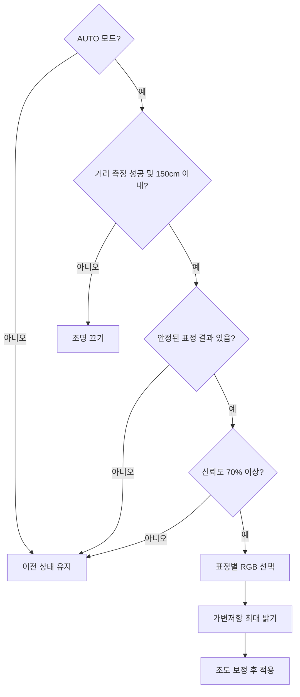

# 9단계. AI 자동 조명과 디지털 트윈

[전체 강의자료](../README.md) · [이전 단계: 표정 특징 AI](../08_expression_ai/README.md) · [다음 단계: 최종 통합과 전시](../10_exhibition/README.md)

## 권장 수업 시간과 결과물

- 권장 시간: 2차시
- 결과물: 거리·표정·신뢰도·가변저항·조도를 우선순위에 따라 판단하는 가상 자동 조명
- 웹 코드: [`web/09_digital_twin`](../../web/09_digital_twin)
- 판단 함수: [`policy.mjs`](../../web/09_digital_twin/policy.mjs)
- 로컬 주소: `http://localhost:8000/web/09_digital_twin/`

## 이번 단계에서 만들 것

표정 분류 결과 하나만으로 조명을 즉시 바꾸지 않고, 거리·신뢰도·가변저항·조도·모드를 순서대로 확인하는 자동 조명을 만듭니다. 최종 명령과 화면 속 무드등이 같은 상태를 나타내게 합니다.

Part 8의 AI 분류와 실제 센서를 바로 연결하기 전에 슬라이더로 모든 조건을 재현합니다. 실제 장치에서는 만들기 어려운 경계값과 오류 조건도 안전하게 시험할 수 있습니다.

## 핵심 질문

여러 입력이 충돌할 때 최종 출력은 어떤 순서로 결정해야 할까요?

## 학습목표

- 여러 입력에 우선순위를 정해 하나의 출력으로 결정할 수 있다.
- `적용`, `끄기`, `이전 상태 유지`의 차이를 설명할 수 있다.
- 경계값 바로 아래와 위를 시험해 조건문의 동작을 확인할 수 있다.
- 센서 방향과 실제 측정값을 정책에 반영할 수 있다.

## 시작 전 확인

- [ ] Part 6에서 조도센서값은 클수록 어둡다는 것을 확인했다.
- [ ] Part 8에서 현재 판정, 최근 결과, 신뢰도의 차이를 확인했다.
- [ ] 프로젝트 루트에서 로컬 웹서버를 실행했다.
- [ ] 9단계는 실제 Arduino와 웹캠을 연결하지 않는 정책 검증 화면임을 이해했다.

## 판단 순서

1. MANUAL 모드이면 자동 명령을 만들지 않습니다.
2. 거리 측정에 실패하거나 사람이 150cm 밖에 있으면 조명을 끕니다.
3. 안정된 표정 결과가 없으면 이전 상태를 유지합니다.
4. 신뢰도가 70% 미만이면 이전 상태를 유지합니다.
5. 표정에 대응하는 RGB를 고릅니다.
6. 가변저항으로 사용자가 정한 최대 밝기를 계산합니다.
7. 실측으로 방향이 확인된 경우에만 조도 보정을 적용합니다.

이 순서는 단순한 나열이 아닙니다. 먼저 만족한 조건이 이후 조건보다 우선합니다. 예를 들어 사람이 150cm 밖에 있다면 표정 신뢰도가 아무리 높아도 조명을 끕니다.

## 세 가지 판단 결과

| 결과 | 뜻 | 조명 명령 |
|---|---|---|
| 적용 `apply` | 새 색과 밝기를 적용 | `LIGHT,R,G,B,밝기,AUTO` |
| 끄기 `off` | 안전하게 밝기 0 적용 | `LIGHT,0,0,0,0,AUTO` |
| 유지 `hold` | 새 명령을 보내지 않음 | 명령 없음 |

`hold`는 밝기 0을 보내는 것이 아닙니다. 신뢰할 수 있는 새 판단이 나올 때까지 이전 조명 상태를 그대로 두는 것입니다.

## 자동 판단 흐름

## 키트 없이 시험하기

먼저 [`web/09_digital_twin`](../../web/09_digital_twin)의 슬라이더로 판단 함수만 독립 시험합니다. 경계값 시험을 통과하면 Part 8까지 누적한 자신의 웹 파일에 `policy.mjs`를 연결합니다.

1. `decideAutomaticLight()`에 MANUAL 조건을 먼저 작성합니다.
2. 거리 범위 밖의 OFF 조건을 추가하고 150cm와 151cm를 시험합니다.
3. 표정 없음과 신뢰도 부족의 HOLD 조건을 추가합니다.
4. 표정별 RGB, 가변저항 상한, 조도 보정을 차례로 추가합니다.
5. `commandLine()`으로 Arduino 명령을 만들고 기존 전송 함수에 연결합니다.
6. 실제 `light_state` 응답이 올 때만 기존 디지털 트윈을 갱신합니다.

조건을 하나 추가할 때마다 바로 아래·경계·바로 위의 세 값을 시험합니다.

| 바꿀 조건 | 확인할 결과 |
|---|---|
| 거리 151cm 이상 | OFF 명령 |
| 신뢰도 69% | 이전 상태 유지 |
| 신뢰도 70% | 조건을 만족하면 새 색 적용 |
| 표정 `확인 중` | 이전 상태 유지 |
| 가변저항 0 | 밝기 0 |
| MANUAL 모드 | 자동 명령 없음 |

## 1차시. 기본 시나리오와 경계값 시험

### 시나리오 1. 정상 자동 조명

- 모드: `AUTO`
- 거리: `60cm`
- 가변저항: `700`
- 표정: `미소`
- 신뢰도: `0.90`
- 조도센서 방향: `밝을수록 값이 작음 · 실측 확정`

판단 결과에 미소 자동 조명과 주황 계열 명령이 나타나야 합니다.

### 시나리오 2. 거리 경계

거리만 150cm와 151cm로 바꾸어 비교합니다.

| 거리 | 예상 결과 | 실제 결과 | 이유 |
|---:|---|---|---|
| 150cm | 조건이 맞으면 적용 |  | 범위 이내 |
| 151cm | 끄기 |  | 범위 밖 |

### 시나리오 3. 신뢰도 경계

거리를 60cm로 되돌리고 신뢰도를 0.69와 0.70으로 비교합니다.

| 신뢰도 | 예상 결과 | 실제 결과 | 이유 |
|---:|---|---|---|
| 0.69 | 이전 상태 유지 |  | 기준 미만 |
| 0.70 | 조건이 맞으면 적용 |  | 기준 이상 |

경계값 하나만 시험하면 `>`와 `>=` 중 어떤 조건을 사용했는지 확인할 수 없습니다. 경계 바로 아래, 경계, 경계 바로 위를 함께 시험해야 합니다.

## 조도센서 방향을 선택하는 이유

키트의 분압 회로 방향에 따라 밝을 때 값이 커질 수도, 작아질 수도 있습니다. 3단계 측정 결과로 방향을 선택하기 전까지는 조도값을 표시만 하고 밝기 계산에는 사용하지 않습니다.

실제 키트에서는 밝을 때 약 15, 가렸을 때 약 850이었으므로 `lower_is_brighter`, 즉 값이 작을수록 밝은 환경으로 설정합니다. 환경이 밝을 때 LED 밝기를 줄이고 어두울 때 사용자가 정한 상한에 가깝게 만듭니다.

### 밝기 계산의 두 단계

1. 가변저항으로 사용자가 허용한 최대 밝기를 계산합니다.
2. 주변이 밝으면 그 범위 안에서 LED 밝기를 낮춥니다.

가변저항이 0이면 조도와 관계없이 최종 밝기도 0입니다. 조도 보정이 사용자 상한을 넘어 밝기를 키우지는 않습니다.

## 표정과 색상 규칙

| 표정 특징 범주 | RGB | 출력 색 |
|---|---|---|
| 미소 | 255, 170, 40 | 따뜻한 주황 |
| 중립 | 90, 150, 255 | 차분한 파랑 |
| 놀란 표정 | 175, 80, 255 | 선명한 보라 |
| 찡그린 표정 | 40, 210, 145 | 안정적인 초록 |

색은 실제 감정 판정이 아니라 네 가지 얼굴 특징 범주를 시각적으로 구분하기 위한 출력 규칙입니다.

## 2차시. 정책 시험표 완성

한 번에 한 조건만 바꾸며 결과를 기록합니다.

| 번호 | 모드 | 거리 | 표정 | 신뢰도 | 가변저항 | 조도 | 예상 결과 | 실제 결과 |
|---:|---|---:|---|---:|---:|---:|---|---|
| 1 | AUTO | 60 | 미소 | 0.90 | 700 | 500 | 주황 적용 |  |
| 2 | AUTO | 151 | 미소 | 0.90 | 700 | 500 | 끄기 |  |
| 3 | AUTO | 60 | 확인 중 | 0.90 | 700 | 500 | 유지 |  |
| 4 | AUTO | 60 | 중립 | 0.69 | 700 | 500 | 유지 |  |
| 5 | AUTO | 60 | 중립 | 0.70 | 700 | 500 | 파랑 적용 |  |
| 6 | AUTO | 60 | 놀란 표정 | 0.90 | 0 | 500 | 밝기 0 적용 |  |
| 7 | MANUAL | 60 | 찡그린 표정 | 0.90 | 700 | 500 | 유지 |  |

## 정책을 바꾸고 비교하기

감지 거리 기준을 100cm와 200cm, 신뢰도 기준을 60%와 80%로 바꾼다고 가정합니다.

| 정책 | 장점 | 단점 | 적합한 사용 상황 |
|---|---|---|---|
| 거리 100cm |  |  |  |
| 거리 200cm |  |  |  |
| 신뢰도 60% |  |  |  |
| 신뢰도 80% |  |  |  |

정책에는 하나의 정답만 있는 것이 아닙니다. 반응 속도, 오작동, 체험 범위를 비교해 목적에 맞는 기준을 정합니다.

## 도전과제

1. 감지 거리를 100cm와 200cm로 바꾸어 오작동과 반응 범위를 비교합니다.
2. 신뢰도 기준을 60%·70%·80%로 바꾸어 반응 속도와 안정성을 비교합니다.
3. 조명 변경 후 1.5초 동안 다음 변경을 막는 쿨다운을 추가합니다.
4. Arduino의 `light_state` 응답을 받은 뒤에만 디지털 트윈을 갱신합니다.

## Part 9 마무리 질문

1. 사람이 감지 범위 밖에 있고 신뢰도는 90%일 때 왜 조명을 꺼야 하는가?
2. `hold`와 `off`는 어떻게 다른가?
3. 신뢰도 0.69와 0.70을 모두 시험해야 하는 이유는 무엇인가?
4. 가변저항과 조도센서가 밝기를 결정할 때 각각 어떤 역할을 하는가?
5. 실제 센서 방향을 확인하기 전에 조도 보정을 적용하면 어떤 문제가 생길 수 있는가?

## 제출할 결과

- 거리와 신뢰도 경계값 실험표
- 7개 정책 시험표
- 정책 변경 비교표
- Part 9 마무리 질문 답변

## 이번 단계 모범답안

활동과 자기 점검을 끝낸 뒤 확인합니다.

- [Part 9 판단 함수 모범답안](../../web/09_digital_twin/policy.mjs)
- [Part 9 경계값 시험 화면](../../web/09_digital_twin)

독립 시험 화면을 자신의 대시보드로 교체하지 말고 `decideAutomaticLight()`, `commandLine()`, 자동 명령 호출 위치만 누적 코드와 비교합니다.

## 다음 단계

Part 10에서는 Part 6의 센서 대시보드, Part 7의 조명 제어, Part 8의 표정 분류, Part 9의 자동 판단을 하나의 페이지와 하나의 Arduino 코드로 통합합니다.
