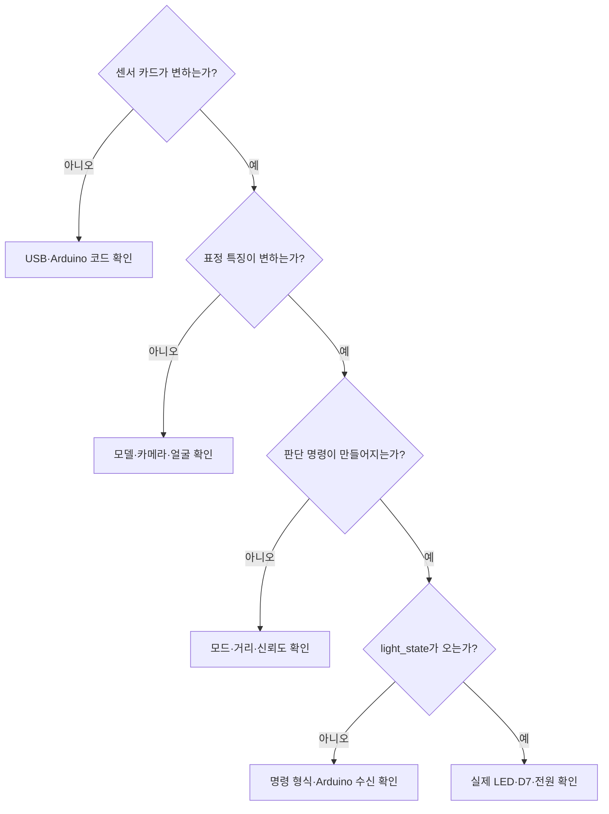

# 10단계. 통합 테스트와 전시 준비

[전체 강의자료](../README.md) · [이전 단계: AI 자동 조명](../09_digital_twin/README.md) · [프로젝트 전체 보기](../../README.md)

## 권장 수업 시간과 결과물

- 권장 시간: 2~3차시
- 결과물: 실제 센서·웹캠·표정 분류·자동 판단·네오픽셀·디지털 트윈이 동시에 작동하는 최종 작품
- Arduino 코드: [`10_final_integration.ino`](../../arduino/10_final_integration/10_final_integration.ino)
- 최종 웹 코드: [`final/10_exhibition`](../../final/10_exhibition)
- 로컬 주소: `http://localhost:8000/final/10_exhibition/`

## 이번 단계에서 만들 것

관람객이 설명 없이도 체험하고, 연결이 끊기거나 AI 판정이 불확실해도 안전하게 복구되는 전시 상태를 완성합니다.

Part 10은 새로운 기능을 더하는 단계이기보다 Part 4~9에서 따로 확인한 기능을 하나의 흐름으로 묶고, 실제 장치와 화면이 끝까지 일치하는지 검증하는 단계입니다.

## 학습목표

- 센서 입력에서 실제 조명 출력까지 전체 데이터 흐름을 설명할 수 있다.
- 웹과 Arduino가 같은 USB 연결로 데이터를 주고받는 과정을 확인할 수 있다.
- 보낸 명령과 실제 적용 응답을 구분할 수 있다.
- 연결 끊김, 센서 지연, 얼굴 놓침 상황을 진단하고 복구할 수 있다.
- 관람객에게 작품의 기능과 AI의 한계를 정확하게 설명할 수 있다.

## 시작 전 확인

- [ ] 센서 네 종류와 네오픽셀이 개별 실습에서 작동했다.
- [ ] Part 7에서 웹 조명 명령과 실제 LED가 일치했다.
- [ ] Part 8에서 네 표정 범주를 학습하고 분류했다.
- [ ] Part 9의 경계값과 판단 우선순위를 확인했다.
- [ ] Arduino IDE 시리얼 모니터를 닫았다.
- [ ] Chrome 또는 Edge의 카메라 권한을 허용할 수 있다.

## 전시 시작 절차

1. Part 9까지 누적한 자신의 Arduino와 웹 파일을 각각 복사해 `part10_final` 체크포인트로 저장합니다.
2. 시리얼 모니터를 닫고 프로젝트 루트에서 `python3 -m http.server 8000`을 실행합니다.
3. Chrome에서 자신의 누적 웹 프로젝트 주소를 엽니다.
4. Arduino USB를 연결하고 센서값 수신을 확인합니다.
5. AI 모델을 준비하고 웹캠을 허용합니다.
6. 네 가지 표정을 3초씩 학습하고 분류를 시작합니다.
7. AUTO 모드로 전환합니다.
8. 거리·표정·조도·가변저항·터치센서를 차례로 시험합니다.
9. 실제 네오픽셀과 디지털 트윈의 RGB·밝기·모드가 같은지 확인합니다.
10. 전체화면으로 전환하고 안내판을 배치합니다.

## 1차시. 최종 통합 실행

### 1. 자신의 누적 코드 통합

새 완성 코드를 열지 않습니다. Part 9까지 작성한 파일에서 아래 기능이 모두 남아 있는지 함수 목록과 `setup()`·`loop()`를 점검합니다.

- 센서 네 종류 측정
- 센서 JSON 전송
- 웹 조명 CSV 명령 수신
- RGB·밝기·모드 범위 검사
- 실제 네오픽셀 적용
- `light_state` JSON 응답

빠진 기능이 있을 때만 해당 Part의 모범답안에서 함수와 호출문을 찾아 보완합니다. 업로드가 끝나면 시리얼 모니터를 닫습니다.

### 2. 로컬 웹서버 실행

프로젝트 루트에서 실행합니다.

```bash
python3 -m http.server 8000
```

Chrome에서 정확히 다음 주소를 엽니다.

```text
http://localhost:8000/final/10_exhibition/
```

### 3. 화면 준비 순서

1. `Arduino 연결`을 누르고 UNO 포트를 고릅니다.
2. 센서 카드 네 개가 갱신되는지 확인합니다.
3. `AI 모델 준비`를 누릅니다.
4. 준비가 끝나면 `웹캠 시작`을 누르고 권한을 허용합니다.
5. 미소·중립·놀란 표정·찡그린 표정을 각각 3초 학습합니다.
6. `분류 시작`을 누릅니다.

Arduino와 AI 모델 준비는 서로 다른 작업입니다. 한쪽이 성공했다고 다른 쪽도 준비된 것은 아닙니다.

### 4. MANUAL 모드 확인

1. 색상과 밝기를 선택합니다.
2. `수동 조명 적용`을 누릅니다.
3. 실제 네오픽셀, `실제 RGB`, `실제 밝기`, 디지털 트윈을 비교합니다.
4. `실제 적용 확인` 또는 최근 Arduino 응답이 표시되는지 봅니다.

### 5. AUTO 모드 확인

터치센서를 한 번 접촉하면 MANUAL에서 AUTO로 전환됩니다. 손을 계속 대고 있지 말고 한 번 접촉한 뒤 뗍니다.

- 사람 감지: 150cm 이내
- 표정 신뢰도: 70% 이상
- 미소: 주황
- 중립: 파랑
- 놀란 표정: 보라
- 찡그린 표정: 초록
- 가변저항: 최대 밝기 결정
- 조도센서: 주변이 밝을수록 밝기 감소

터치할 때마다 `AUTO ↔ MANUAL`이 한 번씩만 전환되어야 합니다.

## 통합 시험표

| 시험 상황 | 기대 동작 | 통과 |
|---|---|---|
| 사람이 감지 범위 밖으로 이동 | LED 꺼짐 | □ |
| 얼굴이 화면에서 사라짐 | 이전 상태 유지 또는 안전하게 꺼짐 | □ |
| 신뢰도 기준 미만 | 색 변경 안 함 | □ |
| USB 케이블 분리 | 오류 표시, 재연결 안내 | □ |
| 페이지 새로고침 | 초기 상태로 안전 복귀 | □ |
| 가변저항 최소 | LED 밝기 0 | □ |
| 조도 급변 | 밝기가 허용 범위 안에서만 변화 | □ |
| 터치센서 한 번 접촉 | AUTO/MANUAL 한 번만 전환 | □ |
| 수동 색·밝기 적용 | 실제 조명과 디지털 트윈 일치 | □ |
| 30분 연속 실행 | 멈춤·과열·메모리 증가 없음 | □ |

## 2차시. 기능별 통합 검증

### 시험 A. 수동 조명과 응답

| 설정 | 보낸 명령 | Arduino 응답 | 실제 조명 | 디지털 트윈 | 통과 |
|---|---|---|---|---|---|
| 파랑·밝기 40 |  |  |  |  |  |
| 주황·밝기 20 |  |  |  |  |  |
| 흰색·밝기 0 |  |  |  |  |  |

### 시험 B. 자동 판단

| 조건 변화 | 예상 결과 | 실제 조명 | 화면 판단 | 통과 |
|---|---|---|---|---|
| 거리 60cm, 미소, 신뢰도 70% 이상 | 주황 적용 |  |  |  |
| 거리 151cm 이상 | 조명 끄기 |  |  |  |
| 신뢰도 70% 미만 | 이전 상태 유지 |  |  |  |
| 가변저항 최소 | 밝기 0 |  |  |  |
| 조도센서 가리기 | 밝기 증가 |  |  |  |
| 터치 한 번 | 모드 한 번 전환 |  |  |  |

### 시험 C. 연결과 복구

| 고장 상황 | 화면에서 보인 증상 | 멈춘 구간 | 복구 방법 | 통과 |
|---|---|---|---|---|
| USB 케이블 분리 |  |  |  |  |
| 웹캠에서 얼굴 사라짐 |  |  |  |  |
| 페이지 새로고침 |  |  |  |  |
| Arduino IDE 시리얼 모니터 실행 |  |  |  |  |

## 개인정보 안내문

> 이 작품은 실제 감정을 알아내지 않습니다. 웹캠에서 추출한 얼굴 모양의 특징을 네 범주로 구분합니다. 영상과 얼굴 사진은 저장하거나 서버로 전송하지 않습니다.

## 관람객 체험 순서

1. 무드등 앞 150cm 이내에 섭니다.
2. 화면에서 얼굴이 감지되는지 확인합니다.
3. 미소·중립·놀란 표정·찡그린 표정 중 하나를 2~3초 유지합니다.
4. 실제 조명과 화면 속 조명이 같은 색인지 확인합니다.
5. 가변저항을 돌려 최대 밝기를 바꿉니다.

관람객이 웹캠 촬영을 원하지 않으면 MANUAL 모드에서 색상과 밝기만 체험할 수 있습니다.

## 관람객용 3문장 설명

1. 무드등 앞에 서면 거리센서가 사람의 접근을 확인합니다.
2. 웹캠 AI가 얼굴 모양의 특징을 네 범주로 구분합니다.
3. 센서와 AI 결과를 함께 판단해 실제 조명과 화면 속 조명이 같은 색으로 바뀝니다.

## 30초 발표

이 작품은 Arduino 센서와 웹캠 AI가 함께 작동하는 Physical AI 무드등입니다. 초음파센서가 사람의 접근을 확인하고, 웹캠에서 추출한 얼굴 특징을 미소·중립·놀란 표정·찡그린 표정으로 분류합니다. 거리, 분류 신뢰도, 주변 밝기, 사용자가 정한 최대 밝기를 함께 판단해 실제 네오픽셀과 화면 속 디지털 트윈을 같은 상태로 바꿉니다. 영상과 얼굴 사진은 저장하지 않으며 실제 감정을 판정하는 장치가 아닙니다.

## 복구 순서

1. 화면에 표시된 입력 중 마지막으로 멈춘 항목을 찾습니다.
2. USB 연결 → 센서 데이터 → 웹캠 → AI 결과 → 조명 명령 순으로 확인합니다.
3. Arduino IDE 시리얼 모니터가 포트를 차지하지 않았는지 확인합니다.
4. 페이지에서 연결을 해제하고 다시 연결합니다.
5. 해결되지 않으면 MANUAL 모드로 전환해 조명만 안전하게 유지합니다.

## 오류 위치를 찾는 방법



화면의 마지막 정상 지점을 찾으면 문제 범위를 줄일 수 있습니다. 모든 파일을 처음부터 다시 바꾸지 않습니다.

## 실제 작동 구조

```text
Arduino 센서 → USB JSON → 웹 센서 화면
웹캠 → 얼굴 특징값 → KNN 표정 분류
센서값 + 안정된 표정 → 자동 판단 → 조명 CSV 명령
Arduino 네오픽셀 적용 → light_state JSON → 디지털 트윈
```

화면 속 조명은 웹이 보낸 값을 바로 표시하지 않습니다. Arduino가 실제 적용한 뒤 보낸 `light_state`를 받아야 바뀝니다. 따라서 실제 조명과 화면이 다르면 통신의 어느 방향에서 문제가 생겼는지 확인할 수 있습니다.

## 3차시 선택 활동. 전시 운영 시험

### 역할을 나누어 30분 연속 실행

| 역할 | 할 일 | 기록할 내용 |
|---|---|---|
| 체험 안내 | 관람객 순서와 개인정보 안내 | 이해하기 어려워한 설명 |
| 장치 관찰 | 실제 LED와 디지털 트윈 비교 | 불일치 시각과 조건 |
| 데이터 관찰 | 센서·AI·명령 상태 확인 | 멈춤·지연·오류 기록 |
| 복구 담당 | 복구 순서에 따라 조치 | 원인과 복구 시간 |

30분 동안 5분 간격으로 상태를 기록합니다.

| 경과 시간 | 센서 수신 | 웹캠·AI | 실제 조명 | 디지털 트윈 | 오류·발열 |
|---:|---|---|---|---|---|
| 0분 |  |  |  |  |  |
| 5분 |  |  |  |  |  |
| 10분 |  |  |  |  |  |
| 15분 |  |  |  |  |  |
| 20분 |  |  |  |  |  |
| 25분 |  |  |  |  |  |
| 30분 |  |  |  |  |  |

## Part 10 마무리 질문

1. 최종 작품에서 Arduino가 웹으로 보내는 데이터와 웹이 Arduino로 보내는 데이터는 각각 무엇인가?
2. 터치센서의 현재 상태가 아니라 `false → true` 순간으로 모드를 바꾸는 이유는 무엇인가?
3. 디지털 트윈이 보낸 명령이 아니라 `light_state` 응답을 따라야 하는 이유는 무엇인가?
4. 표정 분류 신뢰도가 낮을 때 이전 상태를 유지하는 것이 즉시 색을 바꾸는 것보다 나은 이유는 무엇인가?
5. 작품이 실제 감정 인식기가 아니라는 점을 관람객에게 어떻게 설명할 것인가?

## 최종 제출물

- 통합 시험표
- 수동 조명, 자동 판단, 연결 복구 시험 기록
- 30초 발표문 또는 관람객용 3문장 설명
- 30분 연속 실행 기록표(선택)
- Part 10 마무리 질문 답변

## 최종 모범답안 비교

모든 통합 시험을 마친 뒤 확인합니다.

- [Part 10 Arduino 최종 모범답안](../../arduino/10_final_integration/10_final_integration.ino)
- [Part 10 웹 최종 모범답안](../../final/10_exhibition)

자신의 코드를 통째로 교체하지 않습니다. 빠진 함수, 함수 호출 순서, 전송 형식, 이벤트 연결을 비교하고 필요한 부분만 수정한 뒤 시험표를 다시 실행합니다.

## 프로젝트 완료 기준

- [ ] 센서 네 종류가 200ms 주기로 안정적으로 수신된다.
- [ ] 네 표정 범주의 학습과 분류가 가능하다.
- [ ] MANUAL과 AUTO가 터치 한 번에 한 번씩 전환된다.
- [ ] 거리·신뢰도·가변저항·조도 정책이 예상대로 작동한다.
- [ ] 실제 네오픽셀과 디지털 트윈이 `light_state` 기준으로 일치한다.
- [ ] 연결을 끊거나 페이지를 새로고쳐도 복구할 수 있다.
- [ ] 개인정보와 AI 한계를 정확하게 안내할 수 있다.
