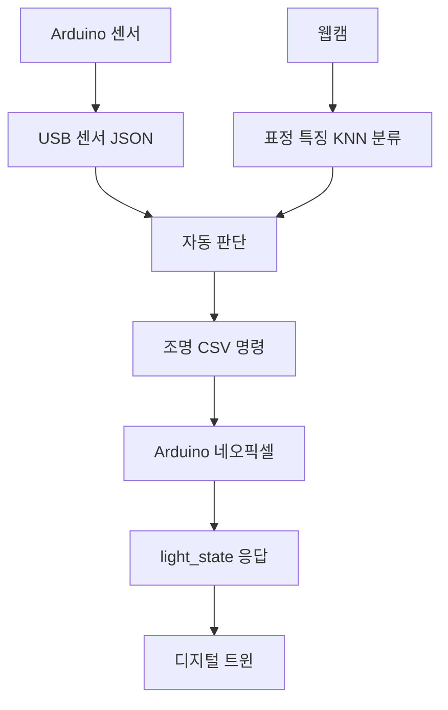

# 학생용 프로젝트 강의자료

이 자료는 Arduino UNO, 센서 네 종류, 네오픽셀, 웹캠, 웹 기술을 하나씩 연결해 **Physical AI 무드등**을 완성하는 실습 과정입니다. 완성 코드를 처음부터 한꺼번에 실행하지 않고, 입력·통신·시각화·AI·출력을 단계별로 확인합니다.

## 전체 구성

| Part | 주제 | 학생이 완성하는 것 | 주요 개념 |
|---|---|---|---|
| [Part 1](01_project_overview/README.md) | 프로젝트 이해 | 작품의 입력·처리·출력 구조 | Physical AI, 시스템 흐름 |
| [Part 2](02_component_test/README.md) | 키트 조립과 점검 | 센서 4종과 네오픽셀 동작 확인 | 핀, 전원, 시리얼 모니터 |
| [Part 3](03_sensor_basics/README.md) | 센서별 기본 실습 | 각 센서값과 RGB 출력 확인 | 아날로그·디지털 입력, 거리, RGB |
| [Part 4](04_modular_controller/README.md) | Arduino 기능 통합 | 기능을 함수로 나눈 통합 코드 | 함수, 상태, `millis()` |
| [Part 5](05_web_serial/README.md) | Arduino와 웹 연결 | USB로 센서 JSON 송수신 | Web Serial, JSON Lines |
| [Part 6](06_dashboard/README.md) | 데이터 시각화 | 센서 카드와 실시간 그래프 | 시계열, 오류 데이터, 대시보드 |
| [Part 7](07_light_control/README.md) | 웹에서 조명 제어 | RGB·밝기 명령과 디지털 트윈 | CSV 명령, 검증, 응답 |
| [Part 8](08_expression_ai/README.md) | 표정 특징 AI | 개인별 KNN 표정 분류 | 특징값, 학습 데이터, 신뢰도 |
| [Part 9](09_digital_twin/README.md) | 자동 판단 규칙 | 센서와 AI를 결합한 가상 자동 조명 | 우선순위, 경계값, 정책 함수 |
| [Part 10](10_exhibition/README.md) | 최종 통합과 전시 | 실제 조명과 디지털 트윈 통합 작품 | 양방향 통신, 상태 동기화, 복구 |

## Part 4 이후 권장 운영

| Part | 권장 차시 | 실물 키트 | 웹캠 | 핵심 결과물 |
|---|---:|---|---|---|
| Part 4 | 2차시 | 필요 | 불필요 | 모듈형 Arduino 프로그램 |
| Part 5 | 2차시 | 필요 | 불필요 | 센서 JSON 통신 화면 |
| Part 6 | 2차시 | 선택 | 불필요 | 실시간 센서 그래프 |
| Part 7 | 2차시 | 선택 | 불필요 | 웹 조명 제어와 2D 트윈 |
| Part 8 | 2~3차시 | 불필요 | 필요 | 개인별 표정 분류기 |
| Part 9 | 2차시 | 불필요 | 불필요 | 자동 조명 판단 규칙 |
| Part 10 | 2~3차시 | 필요 | 필요 | 최종 통합 작품과 전시 점검표 |

한 차시는 45~50분을 기준으로 합니다. Part 5부터는 Chrome 또는 Edge를 사용합니다.

## 웹페이지 실행 방법

프로젝트 폴더를 웹사이트의 시작 폴더로 지정합니다.

```bash
cd physical-ai-mood-light
python3 -m http.server 8000
```

터미널에 `Serving HTTP on ... port 8000`이 표시되면 서버가 실행 중입니다. 코드를 수정한 뒤에는 서버를 다시 켤 필요 없이 파일을 저장하고 브라우저를 새로고침합니다. 종료할 때는 서버를 실행한 터미널에서 `Control + C`를 누릅니다.

| Part | 로컬 주소 |
|---|---|
| Part 5 | `http://localhost:8000/web/05_web_serial/` |
| Part 6 | `http://localhost:8000/web/06_dashboard/` |
| Part 7 | `http://localhost:8000/web/07_light_control/` |
| Part 8 | `http://localhost:8000/web/08_expression_ai/` |
| Part 9 | `http://localhost:8000/web/09_digital_twin/` |
| Part 10 | `http://localhost:8000/final/10_exhibition/` |

## 공통 실습 원칙

1. 현재 단계의 정상 작동 확인표를 모두 확인한 뒤 다음 Part로 이동합니다.
2. Arduino IDE의 시리얼 모니터와 웹페이지는 같은 포트를 동시에 사용할 수 없습니다.
3. 웹페이지와 실제 장치가 다르게 보이면 입력 → 판단 → 명령 → 실제 응답 순서로 확인합니다.
4. 네오픽셀 밝기는 USB 전원을 고려해 `0~80` 범위에서 사용합니다.
5. 얼굴 영상은 저장하거나 전송하지 않습니다. 결과는 실제 감정이 아니라 화면에 나타난 표정 특징의 분류입니다.

## 최종 작품의 데이터 흐름



디지털 트윈은 웹이 보낸 명령만 보고 바뀌지 않습니다. Arduino가 실제 조명을 적용한 뒤 돌려준 `light_state`를 받아야 갱신됩니다.
